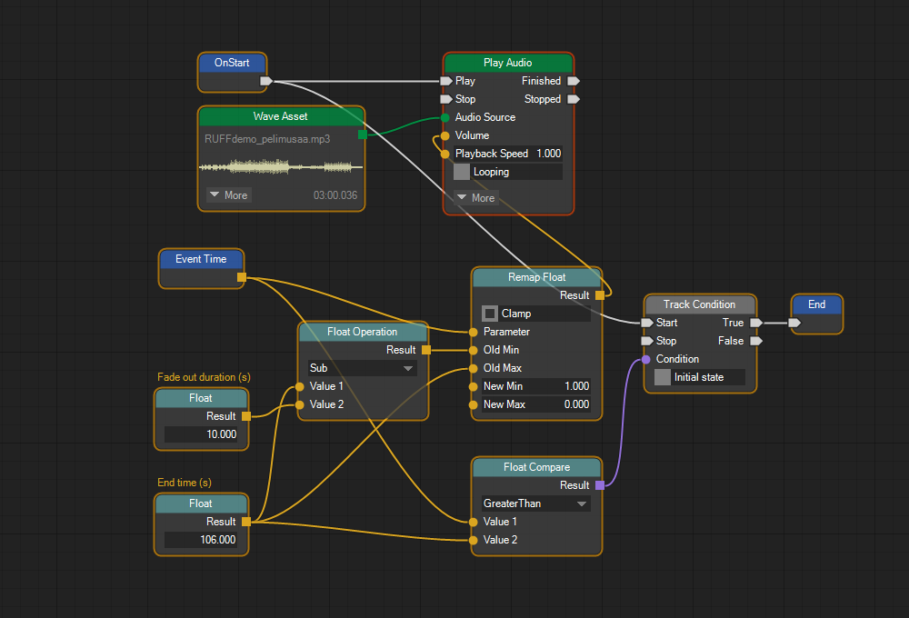

## ❔ What's this?

This is a fork of the **STNodeEditor** library, a WinForms framework for viewing and editing node graphs. Check out the original library for more information: https://github.com/DebugST/STNodeEditor

## ❔ This fork

This fork adds some new features to the framework. Mostly usability and visual tweaks.
